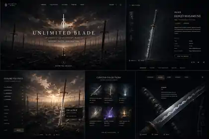

# Unlimited Blade Works

Immersive 3D archive for legendary blades from history, myth, and imagination.

## Visual direction

The target experience combines a cinematic field of blades with a restrained museum/archive interface. The reference image is a concept direction rather than a final UI specification.

## Product direction

- Cinematic sword-field landing experience inspired by the *idea* of an infinite blade world, while maintaining an original visual identity.
- Real-time 3D exploration and artifact inspection in the browser.
- Cloudflare Workers as the application/API runtime.
- Cloudflare D1 for structured archive data and R2 for GLB/KTX2/HDR/audio assets.
- GitHub-driven deployment to Cloudflare.

## Planned stack

- React + TypeScript + Vite
- Three.js + React Three Fiber + Drei
- Theatre.js for cinematic sequences
- Hono on Cloudflare Workers
- Cloudflare D1 + R2

## Documents

- [`docs/PRODUCT_TECHNICAL_DESIGN.md`](docs/PRODUCT_TECHNICAL_DESIGN.md) — product and technical design.
- [`docs/REFERENCES.md`](docs/REFERENCES.md) — websites, open-source projects, platform references, asset pipeline and visual direction.

## Copyright note

Fate/Unlimited Blade Works is treated only as high-level mood inspiration. This project should not copy copyrighted scene composition, artwork, logos, models, typography or other production assets; the final visual identity and assets must be original or appropriately licensed.
