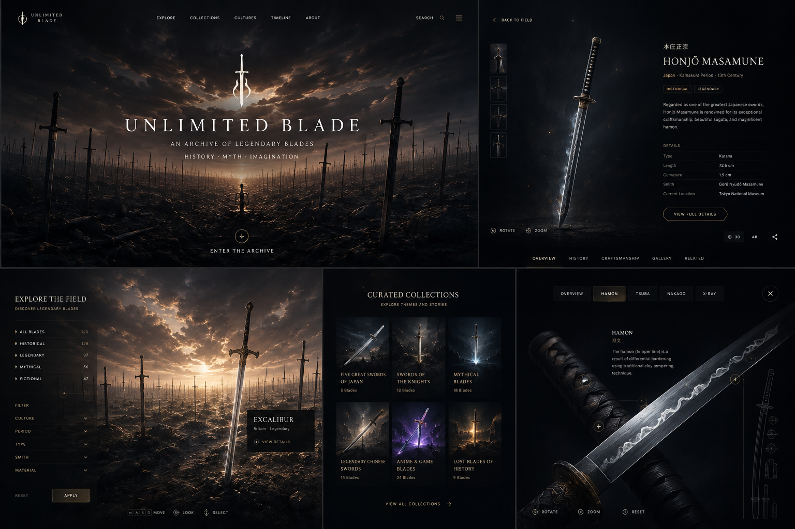

# Unlimited Blade Works — References

This document collects visual, interaction, architecture, and open-source references for the project. References are for studying techniques and interaction patterns; the product should maintain an original visual identity and must not reproduce copyrighted Fate/Unlimited Blade Works artwork, assets, logos, scene composition, or weapon models.

## Visual direction

The current approved direction is a cinematic, dark museum/archive aesthetic combined with an explorable field of blades:



Key traits to preserve:

- near-black UI with restrained warm gold/ivory accents;
- a large cinematic blade field as the primary spatial experience;
- sparse typography and minimal HUD-like controls;
- selected blades become high-detail 3D artifacts;
- museum-grade information hierarchy rather than game inventory UI;
- detail modes such as blade, hamon, guard/tsuba, handle, inscription/nakago and scabbard;
- transitions should feel spatial: discover → select → draw/lift → inspect → return to field.

## Website / experience references

### Bruno Simon Portfolio

- Site: https://bruno-simon.com/
- Source: https://github.com/brunosimon/folio-2019
- Study: treating a realtime 3D world as the website itself, camera/navigation language, onboarding, interaction prompts, loading strategy and performance trade-offs.

### Three.js examples

- https://threejs.org/examples/
- Study: instancing, GPU picking, post-processing, WebGPU/WebGL rendering, particles, environment rendering, shaders, loaders and performance techniques.

### glTF Sample Viewer

- https://github.khronos.org/glTF-Sample-Viewer-Release/
- Source: https://github.com/KhronosGroup/glTF-Sample-Viewer
- Study: standards-compliant PBR/glTF presentation and validation of blade assets.

## Core open-source references

### React Three Fiber

- https://github.com/pmndrs/react-three-fiber
- React renderer for Three.js. Recommended foundation for the interactive 3D application layer.

### Drei

- https://github.com/pmndrs/drei
- Useful helpers for R3F: environments, controls, loaders, instances, HTML annotations, bounds, staging and abstractions.

### gltfjsx

- https://github.com/pmndrs/gltfjsx
- Converts glTF/GLB assets into reusable React components. Useful when blade parts need semantic node access such as `blade`, `hamon`, `tsuba`, `handle`, `nakago`, and `scabbard`.

### Theatre.js

- https://github.com/theatre-js/theatre
- Cinematic sequencing/timeline system. Reference for opening sequences, camera choreography, blade-selection transitions and lighting/fog animation.

### Google model-viewer

- https://github.com/google/model-viewer
- Reference implementation for user-friendly web 3D model inspection, camera controls, hotspots/annotations, environment lighting and mobile UX.

### PlayCanvas Model Viewer

- https://github.com/playcanvas/model-viewer
- Reference for professional model inspection, PBR/material controls and model debugging workflows.

### Triplex

- https://github.com/pmndrs/triplex
- Visual workspace for React Three Fiber. Potential tool for rapidly composing and tuning the blade field, lights and camera framing.

### pmndrs/postprocessing

- https://github.com/pmndrs/postprocessing
- R3F-friendly post-processing stack for bloom, depth of field, vignette, tone mapping and other cinematic effects.

### Rapier / react-three-rapier

- https://github.com/pmndrs/react-three-rapier
- Optional physics layer if later versions need collision, first-person navigation or physical blade interactions. Not required for V0.1.

## Platform references

### Cloudflare Workers

- https://developers.cloudflare.com/workers/
- Application/API runtime and deployment target.

### Workers Static Assets

- https://developers.cloudflare.com/workers/static-assets/
- Serve the React/Vite application and Worker API as one deployment unit.

### Cloudflare Vite plugin

- https://developers.cloudflare.com/workers/vite-plugin/
- Recommended local development/build integration for Vite + Workers.
- React SPA + API tutorial: https://developers.cloudflare.com/workers/vite-plugin/tutorial/
- Static asset routing: https://developers.cloudflare.com/workers/vite-plugin/reference/static-assets/

### Cloudflare D1

- https://developers.cloudflare.com/d1/
- Structured blade metadata, taxonomy, relations and source records.
- Migrations: https://developers.cloudflare.com/d1/reference/migrations/
- Prepared statements: https://developers.cloudflare.com/d1/worker-api/prepared-statements/

### Cloudflare R2

- https://developers.cloudflare.com/r2/
- GLB/glTF, KTX2 textures, HDR environments, thumbnails and audio assets.
- Cache via custom domain: https://developers.cloudflare.com/cache/interaction-cloudflare-products/r2/

### Workers observability

- https://developers.cloudflare.com/workers/observability/
- Worker request/error metrics, logs and traces; client-side frame-time and experience events remain application telemetry.

### Cloudflare Workers Builds / Git integration

- https://developers.cloudflare.com/workers/ci-cd/builds/
- GitHub commits should automatically build and deploy the application.

## Asset pipeline references

### glTF / GLB

- https://www.khronos.org/gltf/
- Primary runtime 3D asset format.

### glTF Transform

- https://github.com/donmccurdy/glTF-Transform
- Optimize, deduplicate, resize textures, compress meshes and prepare GLB assets for web delivery.

### KTX2 / Basis Universal

- https://github.com/BinomialLLC/basis_universal
- GPU-friendly compressed textures for reducing VRAM, transfer size and texture decode overhead.

### Blender

- https://www.blender.org/
- Primary DCC tool for cleaning blade models, defining semantic object names, generating LODs and exporting GLB.

## Architecture synthesis

```text
GitHub
  │ push
  ▼
Cloudflare Workers Builds
  │
  ├─ Worker / Hono API
  │    └─ D1 metadata
  │
  └─ Static React application
       └─ React Three Fiber / Three.js
            ├─ Blade Field
            │    ├─ Instanced low-poly background blades
            │    ├─ terrain / atmosphere / fog / particles
            │    └─ picking + cinematic camera
            │
            └─ Artifact Viewer
                 ├─ high-detail GLB from R2
                 ├─ annotations
                 ├─ semantic blade parts
                 └─ inspection sequences

R2
  ├─ models/*.glb
  ├─ textures/*.ktx2
  ├─ environments/*
  └─ audio/*
```

## V0.1 research priorities

1. Benchmark 500–2,000 instanced background swords on desktop and representative mobile hardware.
2. Prototype `/lab/blade-field` with terrain, atmosphere, fog, camera and GPU/object picking.
3. Prototype one high-detail Japanese sword with semantic glTF nodes and annotation hotspots.
4. Test Theatre.js for the opening and field → artifact transition.
5. Define the Blade GLTF Convention before producing the first ten production assets.
6. Establish automatic GLB optimization and R2 upload in the asset pipeline.

## Copyright / originality boundary

The Fate/Unlimited Blade Works concept can be treated as mood inspiration only. Do not copy its exact sky, gears, terrain composition, logos, typography, character silhouettes, weapon assets, animation frames or other recognizable production assets. The project's visual system should be independently designed around the broader idea of an infinite archive/field of legendary blades.
